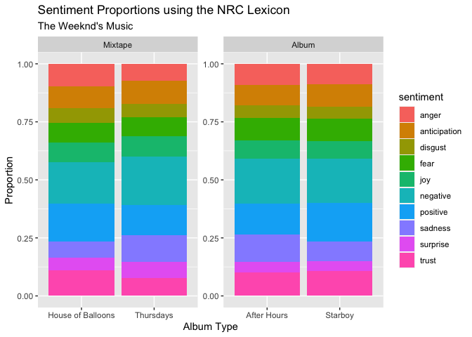
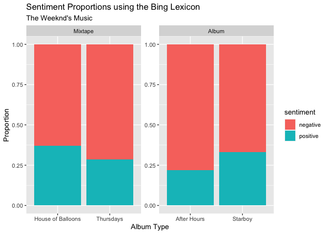
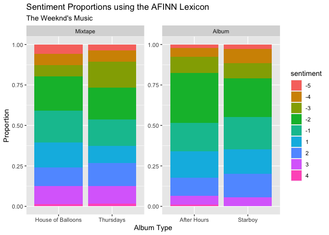

Sentiment Analysis of The Weeknd’s Lyrics Using R’s Most Popular
Lexicons
================
Lara Habashy
02/03/2021

  - [Did The Weeknd Get Sadder?](#did-the-weeknd-get-sadder)
  - [The data](#the-data)
  - [Bag of Words Representation (Mixtapes
    vs. Albums)](#bag-of-words-representation-mixtapes-vs-albums)
  - [Sentiment Analysis with
    *tidytext*](#sentiment-analysis-with-tidytext)
      - [The NRC Lexicon](#the-nrc-lexicon)
      - [The Bing Lexicon](#the-bing-lexicon)
      - [The AFINN Lexicon](#the-afinn-lexicon)
  - [Conclusion](#conclusion)
  - [References](#references)

## Did The Weeknd Get Sadder?

Since releasing three free mixtapes in 2011 that kick-started his music
career and fame, Canadian musician Abel Tesfaye, known by his stage name
“The Weeknd”, went on to release many more albums including 4 studio
albums. He even performed at the Super Bowl this season, a gig usually
awarded to the best of musicians such as Michael Jackson and Shakira. If
The Weeknd only got better over the years, I wonder why I still enjoy
his 2011 mixtapes better. Has The weeknd’s music changed over the past
decade, or is it possible my taste in music has remained stagnant?

As an aspiring data scientist, I took it upon myself to investigate,
using lyrics data, the hypothesis that The Weeknd’s music has changed
over the past decade. To aid in the analysis, I will use R’s `tidytext`
package to perform *sentiment analysis*. Sentiment analysis is usually
applied in problems where we’re interested in knowing how people are
discussing a certain topic, specifically, how they *feel* about it.
Using The Weeknd’s lyrics data, we shall find a convenient way of
extracting sentiment information from the lyrics and analyze the change
of sentiment across time.

## The data

Begin by importing the following R libraries.

``` r
library(tidytext)
library(genius)
library(pacman)
library(tidyverse)
library(dplyr)
library(genius)
library(stringr)
library(janitor)
```

We first start by collecting the lyrics from The Weeknd’s first few
mixtapes and his most recent albums. Using `genius_tracklist()` from the
[`genius`](https://cran.r-project.org/web/packages/genius/genius.pdf)
package in R, we obtain tracklists for the albums of interest and
associated URLs for each track.

``` r
genius_tracklist(artist="The Weeknd", album = "After Hours")
```

    ## # A tibble: 14 x 4
    ##    album_name  track_title         track_n track_url                            
    ##    <chr>       <chr>                 <int> <chr>                                
    ##  1 After Hours Alone Again               1 https://genius.com/The-weeknd-alone-…
    ##  2 After Hours Too Late                  2 https://genius.com/The-weeknd-too-la…
    ##  3 After Hours Hardest To Love           3 https://genius.com/The-weeknd-hardes…
    ##  4 After Hours Scared To Live            4 https://genius.com/The-weeknd-scared…
    ##  5 After Hours Snowchild                 5 https://genius.com/The-weeknd-snowch…
    ##  6 After Hours Escape From LA            6 https://genius.com/The-weeknd-escape…
    ##  7 After Hours Heartless                 7 https://genius.com/The-weeknd-heartl…
    ##  8 After Hours Faith                     8 https://genius.com/The-weeknd-faith-…
    ##  9 After Hours Blinding Lights           9 https://genius.com/The-weeknd-blindi…
    ## 10 After Hours In Your Eyes             10 https://genius.com/The-weeknd-in-you…
    ## 11 After Hours Save Your Tears          11 https://genius.com/The-weeknd-save-y…
    ## 12 After Hours Repeat After Me (I…      12 https://genius.com/The-weeknd-repeat…
    ## 13 After Hours After Hours              13 https://genius.com/The-weeknd-after-…
    ## 14 After Hours Until I Bleed Out        14 https://genius.com/The-weeknd-until-…

``` r
genius_tracklist(artist="The Weeknd", album = "House of Balloons")
```

    ## # A tibble: 9 x 4
    ##   album_name    track_title            track_n track_url                        
    ##   <chr>         <chr>                    <int> <chr>                            
    ## 1 House of Bal… High for This                1 https://genius.com/The-weeknd-hi…
    ## 2 House of Bal… What You Need                2 https://genius.com/The-weeknd-wh…
    ## 3 House of Bal… House of Balloons / G…       3 https://genius.com/The-weeknd-ho…
    ## 4 House of Bal… The Morning                  4 https://genius.com/The-weeknd-th…
    ## 5 House of Bal… Wicked Games                 5 https://genius.com/The-weeknd-wi…
    ## 6 House of Bal… The Party & The After…       6 https://genius.com/The-weeknd-th…
    ## 7 House of Bal… Coming Down                  7 https://genius.com/The-weeknd-co…
    ## 8 House of Bal… Loft Music                   8 https://genius.com/The-weeknd-lo…
    ## 9 House of Bal… The Knowing                  9 https://genius.com/The-weeknd-th…

When attempting to grab the lyrics using genius’s `genius_album()`, the
function fails, producing NA’s for the track’s that it was not
successful in scraping.

``` r
genius_album(artist="The Weeknd", album = "After Hours") %>%
  filter(is.na(lyric))
```

    ## Joining, by = c("album_name", "track_n", "track_url")

    ## # A tibble: 9 x 4
    ##   track_n  line lyric track_title                
    ##     <int> <int> <chr> <chr>                      
    ## 1       1    NA <NA>  Alone Again                
    ## 2       3    NA <NA>  Hardest To Love            
    ## 3       4    NA <NA>  Scared To Live             
    ## 4       5    NA <NA>  Snowchild                  
    ## 5       6    NA <NA>  Escape From LA             
    ## 6       7    NA <NA>  Heartless                  
    ## 7       9    NA <NA>  Blinding Lights            
    ## 8      12    NA <NA>  Repeat After Me (Interlude)
    ## 9      14    NA <NA>  Until I Bleed Out

As such, I will only rely on the tracklists and write a function to loop
over the tracklists and grab the lyrics from each, utilizing the
`genius_lyrics` function. I then use the defined function to grab the
lyrics from the mixtapes *House of Balloons* (2011) and *Thursday*
(2011), and the albums *After Hours* (2019) and *Starboy* (2018).

``` r
#get lyrics from album
get_lyrics <- function(Artist, Album){
  
  tracklist = genius_tracklist(artist=Artist, album = Album)     # genius defined function returns tracklists
  
  lyrics_list = NULL
  for(song_num in 1:dim(tracklist)[1]){
    song_length = 1
    counter = 0     # avoid infinite loops
    
    while(song_length<=1 & counter<10){
      counter = counter +1
      (new_song = genius_lyrics(artist=Artist ,song= tracklist$track_title[song_num])) # get lyrics lines
      Sys.sleep(1) # avoid overloading
      song_length = dim(new_song)[1]
    }
    lyrics_list = rbind(lyrics_list, new_song) # join song names to lyrics
    lyrics_list = na.omit(lyrics_list)         # remove empty lyrics lines
  }
  return(lyrics_list)
}
```

``` r
# get mixtapes lyrics
mixtape_1 <- get_lyrics(Artist = "The Weeknd", Album = "House of Balloons") %>%
  mutate(album = "House of Balloons", type = "Mixtape")
mixtape_2 <- get_lyrics(Artist = "The Weeknd", Album = "Thursday") %>%
  mutate(album = "Thursdays", type = "Mixtape")

# get album lyrics
album_1 <- get_lyrics(Artist = "The Weeknd", Album = "After Hours") %>%
  mutate(album = "After Hours", type = "Album")
album_2 <- get_lyrics(Artist = "The Weeknd", Album = "Starboy") %>%
  mutate(album = "Starboy", type = "Album")

# merge albums and mixtapes lyrics
albums <- rbind(album_1, album_2)
mixtapes <- rbind(mixtape_1, mixtape_2)
lyrics <- rbind(albums, mixtapes)
```

``` r
head(lyrics)
```

    ## # A tibble: 6 x 5
    ##   track_title  line lyric                                        album     type 
    ##   <chr>       <int> <chr>                                        <chr>     <chr>
    ## 1 Alone Again     1 Take off my disguise                         After Ho… Album
    ## 2 Alone Again     2 I'm living someone else's life               After Ho… Album
    ## 3 Alone Again     3 Suppressing who I was inside                 After Ho… Album
    ## 4 Alone Again     4 So I throw two thousand ones in the sky      After Ho… Album
    ## 5 Alone Again     5 Together we're alone (Together we're alone)  After Ho… Album
    ## 6 Alone Again     6 In Vegas, I feel so at home (In Vegas, I fe… After Ho… Album

## Bag of Words Representation (Mixtapes vs. Albums)

To analyze the difference in lyrics, let us examine the most common
words used by The Weeknd in both album categories (Albums and Mixtapes).
To do this, we will utilize `tidytext`’s
[`unnest_tokens()`](https://www.rdocumentation.org/packages/tidytext/versions/0.3.0/topics/unnest_tokens)
with the argument token=“words”. Here, the tokenization process will
split the songlines into individual words. For example, the line “take
off my disguise” is split into the following four words: “take”, “off”,
“my”, “disguise”. This representation of data is known as
*bag-of-words*, a representation of text that describes the occurrence
of words within a specific document.

``` r
tidy_lyrics <- lyrics %>% 
  select(album, lyric, type)  %>%
  unnest_tokens(output = word, input = lyric, token = "words") %>% # tokenize the whole dataset of lyrics
  group_by(type, album) %>%
  count(word) %>% 
  arrange(desc(n)) %>%
  mutate(album = as.factor(album), type = as.factor(type)) %>%    # reformatting variable types for plotting purposes
  mutate(type = fct_relevel(type, "Mixtape"))

tidy_albums <- lyrics %>% 
  filter(type == "Album") %>%                                     # filter to keep recent music
  select(lyric, type)  %>%
  unnest_tokens(output = word,input = lyric, token = "words") %>% # tokenize Album lyrics 
  group_by(type) %>%
  count(word) %>%                                                 # count occurrences of each word
  arrange(desc(n))                                                # sort words by decreasing order in frequency

tidy_albums
```

    ## # A tibble: 1,289 x 3
    ## # Groups:   type [1]
    ##    type  word      n
    ##    <chr> <chr> <int>
    ##  1 Album i       667
    ##  2 Album you     456
    ##  3 Album the     303
    ##  4 Album oh      292
    ##  5 Album a       226
    ##  6 Album me      224
    ##  7 Album to      221
    ##  8 Album it      206
    ##  9 Album know    205
    ## 10 Album i'm     168
    ## # … with 1,279 more rows

``` r
tidy_mixtapes <- lyrics %>% 
  filter(type == "Mixtape") %>%                                   # filter to keep older music 
  select(lyric, type)  %>%
  unnest_tokens(output = word,input = lyric, token = "words") %>% # tokenize Mixtapes lyrics
  group_by(type) %>%
  count(word) %>%                                                 # count occurrences of each word
  arrange(desc(n))                                                # sort words by decreasing order in frequency

tidy_mixtapes
```

    ## # A tibble: 910 x 3
    ## # Groups:   type [1]
    ##    type    word      n
    ##    <chr>   <chr> <int>
    ##  1 Mixtape you     373
    ##  2 Mixtape i       267
    ##  3 Mixtape the     194
    ##  4 Mixtape it      142
    ##  5 Mixtape me      137
    ##  6 Mixtape a       107
    ##  7 Mixtape i'm      98
    ##  8 Mixtape baby     88
    ##  9 Mixtape girl     86
    ## 10 Mixtape got      83
    ## # … with 900 more rows

This representation of the lyrics seems to be a little difficult to
analyze since both albums and mixtapes have many occurrences of very
similar common words such as *i*, *you*, *the*, etc. To resolve this
issue, we can utilize the package `tidytext` which provides a list of
English *stop words*, words that do not add much meaning to a sentence
such as the, a, and, or, is, etc. Then, using
[anti\_join](https://dplyr.tidyverse.org/reference/join.html), we can
remove all stop words from both datasets of words mixtapes and albums
(ie. `tidy_mixtapes` and `tidy_albums` ).

``` r
data(stop_words)      # load stop words from tidytext

tidy_mixtapes %>% 
  anti_join(stop_words, by = c("word" = "word")) # remove stop words from mixtapes lyrics
```

    ## # A tibble: 643 x 3
    ## # Groups:   type [1]
    ##    type    word      n
    ##    <chr>   <chr> <int>
    ##  1 Mixtape baby     88
    ##  2 Mixtape girl     86
    ##  3 Mixtape la       80
    ##  4 Mixtape ooh      69
    ##  5 Mixtape yeah     62
    ##  6 Mixtape love     55
    ##  7 Mixtape bring    34
    ##  8 Mixtape woah     34
    ##  9 Mixtape money    28
    ## 10 Mixtape fun      27
    ## # … with 633 more rows

``` r
tidy_albums %>% 
  anti_join(stop_words, by = c("word" = "word")) # remove stop words from album lyrics
```

    ## # A tibble: 990 x 3
    ## # Groups:   type [1]
    ##    type  word       n
    ##    <chr> <chr>  <int>
    ##  1 Album yeah     114
    ##  2 Album hey      106
    ##  3 Album feel      96
    ##  4 Album baby      73
    ##  5 Album love      73
    ##  6 Album na        69
    ##  7 Album girl      68
    ##  8 Album coming    63
    ##  9 Album life      62
    ## 10 Album ooh       48
    ## # … with 980 more rows

``` r
tidy_lyrics <- tidy_lyrics %>% 
  anti_join(stop_words, by = c("word" = "word")) # remove stop words from all lyrics
```

After processing the data by removing the stop words, we’re able to get
a better sense of the important common words used in the lyrics of the
albums and mixtapes. This will help better differentiate between the two
album types.

## Sentiment Analysis with *tidytext*

Now that we have the lyrics represented in single words
(i.e. bag-of-words representation), we can apply *lexicons* from the
`tidytext` package to analyze the overall sentiment in the albums. A
lexicon is a corpus (a collection of written texts) of words with an
associated description of the sentiment of each word.

Let’s examine three popular lexicons given by the `tidytext` package in
R.

1.  **nrc** from Saif Mohammad and Peter Turney at the National Research
    Council of Canada
2.  **bing** from Bing Liu and collaborators
3.  **AFINN** from Finn Årup Nielsen

The idea behind these lexicons is the assignment of **single words** to
a score, to measure sentiment. The lexicons are made up of a large
number of English words that are generally assigned into a positive or
negative category. Some lexicons provide word associations with emotions
such as anger, sadness, joy, etc.

### The NRC Lexicon

The NRC lexicon was developed by Saif Mohammad and Peter Turney at the
National Research Council of Canada where I interned last summer\! The
lexicon provides a corpus of 13,901 words and an associated sentiment to
each. It splits words into various associated sentiments. For example,
take the word *abandon*. The NRC lexicon associates the following
sentiments to the word abandon: fear, negative, sadness. Although most
words are assigned a negative or positive sentiment, emotional
sentiments such as fear, anger, trust, and sadness, are heavily present
in the NRC lexicon as well\!

``` r
tidytext::get_sentiments("nrc")
```

    ## # A tibble: 13,901 x 2
    ##    word        sentiment
    ##    <chr>       <chr>    
    ##  1 abacus      trust    
    ##  2 abandon     fear     
    ##  3 abandon     negative 
    ##  4 abandon     sadness  
    ##  5 abandoned   anger    
    ##  6 abandoned   fear     
    ##  7 abandoned   negative 
    ##  8 abandoned   sadness  
    ##  9 abandonment anger    
    ## 10 abandonment fear     
    ## # … with 13,891 more rows

``` r
tidytext::get_sentiments("nrc") %>% # get dictionary of English words by nrc 
  group_by(sentiment) %>%         
  count(sentiment) %>%             # count occurrences of words for each sentiment category
  rename(count=n) %>%  
  arrange(desc(count))             # sort in descending order by frequency of words
```

    ## # A tibble: 10 x 2
    ## # Groups:   sentiment [10]
    ##    sentiment    count
    ##    <chr>        <int>
    ##  1 negative      3324
    ##  2 positive      2312
    ##  3 fear          1476
    ##  4 anger         1247
    ##  5 trust         1231
    ##  6 sadness       1191
    ##  7 disgust       1058
    ##  8 anticipation   839
    ##  9 joy            689
    ## 10 surprise       534

Let us visualize the proportions of nrc lexicon provided sentiments on
our lyrics data.

``` r
nrc_sentiment <- tidy_lyrics %>%
  inner_join(get_sentiments("nrc")) %>% # only keep words that exist in nrc corpus, with associated sentiment
  group_by(type, album) %>%
  count(sentiment) 
```

    ## Joining, by = "word"

``` r
# proportions plot
nrc_sentiment  %>%
  ggplot(aes(fill=sentiment, y=n, x=album)) + 
  geom_bar(position="fill", stat="identity") +
  facet_wrap(~type,scales = "free") +
  ylab("Proportion") +
  xlab("Album Type") +
  ggtitle("Sentiment Proportions using the NRC Lexicon", subtitle = "The Weeknd's Music")
```

<!-- -->

Graphically speaking, it appears that The Weeknd’s music got more
negative and sad over time, with albums showing higher occurrences of
negatively associated sentiments.

### The Bing Lexicon

The second lexicon from `tidytext` is the bing lexicon. The bing
lexicon, from Bing Liu and collaborators, categorizes words in binary
categories of positive and negative.

``` r
tidytext::get_sentiments("bing")
```

    ## # A tibble: 6,786 x 2
    ##    word        sentiment
    ##    <chr>       <chr>    
    ##  1 2-faces     negative 
    ##  2 abnormal    negative 
    ##  3 abolish     negative 
    ##  4 abominable  negative 
    ##  5 abominably  negative 
    ##  6 abominate   negative 
    ##  7 abomination negative 
    ##  8 abort       negative 
    ##  9 aborted     negative 
    ## 10 aborts      negative 
    ## # … with 6,776 more rows

Counting the frequency of sentiments in the corpus provided by the bing
lexicon, we see that there are 4781 words labelled as negative and 2005
words labelled as positive.

``` r
tidytext::get_sentiments("bing") %>%  # get dictionary of English words by bing 
  group_by(sentiment) %>% 
  count(sentiment) %>%               # count occurrences of words for each sentiment category
  rename(count=n) %>% 
  arrange(desc(count))               # sort in descending order by frequency of words
```

    ## # A tibble: 2 x 2
    ## # Groups:   sentiment [2]
    ##   sentiment count
    ##   <chr>     <int>
    ## 1 negative   4781
    ## 2 positive   2005

Next, we can visualize how much of each album’s contents are positive
and how much are negative, according to the bing lexicon.

``` r
bing_sentiment <- tidy_lyrics %>%
  inner_join(get_sentiments("bing")) %>% # only keep words that exist in bing corpus, with associated sentiment
  group_by(type, album) %>%
  count(sentiment) %>%                  # count occurrences of words for each sentiment category
  mutate(value = as.factor(sentiment))
```

    ## Joining, by = "word"

``` r
# proportions plot
bing_sentiment %>%
  ggplot(aes(fill=sentiment, y=n, x=album), color=sentiment)+ 
  geom_bar(position="fill", stat="identity") +
  facet_wrap(~type,scales = "free") +
  ylab("Proportion") +
  xlab("Album Type") +
  ggtitle("Sentiment Proportions using the Bing Lexicon", subtitle = "The Weeknd's Music")
```

<!-- -->

Applying the bing lexicon to the album data and visualizing the
proportions of sentiments found in The Weeknd’s music, it becomes more
clear to see the overall difference in sentiments across the albums. His
latest music, the albums *After Hours* and *Starboy* appear to contain
more negative lyrics than the earlier released mixtapes from 2011.

### The AFINN Lexicon

The third popular lexicon is the AFINN lexicon, developed by Finn Årup
Nielsen between 2009 and 2011. The AFINN lexicon assigns words with a
score between -5 and 5, with negative scores indicating negative
sentiment and positive scores indicating positive sentiment. No words
are assigned a score of 0. The lexicon has 2,477 words, some of which
overlap with the bing lexicon, and each word has a value for how
positive or negative the word might be.

``` r
tidytext::get_sentiments("afinn")
```

    ## # A tibble: 2,477 x 2
    ##    word       value
    ##    <chr>      <dbl>
    ##  1 abandon       -2
    ##  2 abandoned     -2
    ##  3 abandons      -2
    ##  4 abducted      -2
    ##  5 abduction     -2
    ##  6 abductions    -2
    ##  7 abhor         -3
    ##  8 abhorred      -3
    ##  9 abhorrent     -3
    ## 10 abhors        -3
    ## # … with 2,467 more rows

The AFINN lexicon has the majority of words associated with a negative
score, -2 in this case.

``` r
tidytext::get_sentiments("afinn") %>%
  group_by(value) %>% 
  count(value) %>%
  rename(sentiment=value, count=n)
```

    ## # A tibble: 11 x 2
    ## # Groups:   sentiment [11]
    ##    sentiment count
    ##        <dbl> <int>
    ##  1        -5    16
    ##  2        -4    43
    ##  3        -3   264
    ##  4        -2   966
    ##  5        -1   309
    ##  6         0     1
    ##  7         1   208
    ##  8         2   448
    ##  9         3   172
    ## 10         4    45
    ## 11         5     5

Using `inner_join` once again with the AFINN lexicon on our lyrics data,
we can create a visualization of proportions for the sentiment
categories -5, -4, -3, -2, -1, 1, 2, 3, 4, and 5.

``` r
afinn_sentiment <- tidy_lyrics %>%
  inner_join(get_sentiments("afinn")) %>% # only keep words that exist in afinn corpus, with associated sentiment
  group_by(type, album) %>%
  count(value) %>%                       # count frequency of words with associated sentiments for each word
  mutate(value = as.factor(value)) %>%
  rename(sentiment=value)
```

    ## Joining, by = "word"

``` r
# proportions plot
afinn_sentiment %>%
  ggplot(aes(fill=sentiment, y=n, x=album), color=sentiment)+ 
  geom_bar(position="fill", stat="identity") +
  facet_wrap(~type,scales = "free") +
  ylab("Proportion") +
  xlab("Album Type") +
  ggtitle("Sentiment Proportions using the AFINN Lexicon", subtitle = "The Weeknd's Music")
```

<!-- -->

Here, the AFINN lexicon is allowing us to quantify or measure words to a
certain degree. Looking at the visualization above, we can see that the
sentiment scores for the albums are generally more negative than the
sentiment seen in the mixtapes. For instance, a huge proportion of the
words in the albums *After Hours* and *Starboy* are assigned a score of
-2, whereas mixtapes have more equal proportions for each sentiment.
This aligns with the conclusions we derived using the other two
lexicons.

## Conclusion

Based on the proportions visualizations from all three lexicons from
`tidytext`, it appears The Weeknd’s music got more negative and sad
since 2011. It is rumored that The Weeknd has been going through
romantic hardships which perhaps could be the reason for his music
getting sadder. Or perhaps fame is the reason? There is much more to
investigate\!

Although we were not able to reach a definitive conclusion regarding
whether there is a quantifiable significant difference in The Weeknd’s
albums and mixtapes, we obtained some evidence to support my initial
suspicion. With grounds for further research, I will need to perform
hypothesis testing to determine whether both albums and mixtapes have
different sentiment distributions. Also, since the meanings of words
change over time, we may consider creating our own lexicon for music
applications. Stay tuned\!

## References

<https://www.tidytextmining.com/sentiment.html> <br>
<https://dplyr.tidyverse.org/reference/join.html> <br>
<https://cran.r-project.org/web/packages/tidytext/vignettes/tidytext.html>
<br> <https://cran.r-project.org/web/packages/genius/index.html> <br>
<https://cran.r-project.org/web/packages/dplyr/vignettes/dplyr.html>
<br> <https://cran.r-project.org/web/packages/ggplot2/index.html> <br>
<http://corpustext.com/reference/sentiment_afinn.html>
